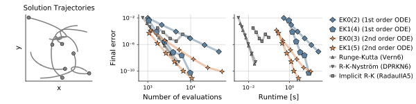
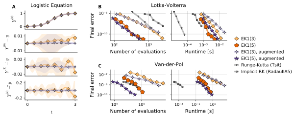
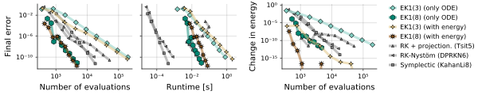
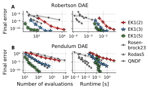

# Pick-and-Mix Information Operators for Probabilistic ODE Solvers - Code

This repo contains the code which was used to compute the results of the paper **"Pick-and-Mix Information Operators for Probabilistic ODE Solvers"**, accepted at AISTATS 2022.


---

__To solve differential equations in Julia with probabilistic numerical solvers, have a look at our package
[ProbNumDiffEq.jl](https://github.com/nathanaelbosch/ProbNumDiffEq.jl).__
Much of the new functionality presented in this paper is already available in ProbNumDiffEq.jl and will be covered in the documentation.

---

A __Python__ implementation of probabilistic numerical ODE solvers, as well as many other probabilistic numerical methods, is maintained in __[ProbNum](https://github.com/probabilistic-numerics/probnum)__ (`pip install probnum`).

---


## Running the code to recreate our experiments
First open `julia`, activate the local environment, and instantiate it to install all the packages:
```
julia> ]
(v1.7) pkg> activate .
(v1.7) pkg> instantiate
```
and you can quit the `pkg` environment by hitting backspace.

To run a julia script from the Julia REPL, do
```
julia> include("myscript.jl")
```

### Generating figure 1
Run the script `./experiments/0_kepler_samples/main.jl`
to obtain `./experiments/0_kepler_samples/figure1.pdf`:

<p align="center">

</p>


### Case study 1: Second-order ODEs
The experiment script is `./experiments/1_secondorder_odes/1_compute_solutions.jl`.
Then, with `./experiments/1_secondorder_odes/2_plot_solutions.jl` you obtain the plot

<p align="center">

</p>


### Case study 2: Additional second-derivative information
The experimentc can be run with
- `./experiments/2_additional_derivatives/2.1_lotkavolterra.jl`
- `./experiments/2_additional_derivatives/2.2_vanderpol.jl`

Then, to plot run `./experiments/2_additional_derivatives/3_plot_all.jl`

<p align="center">

</p>


### Case study 3: Dynamical systems with conserved quantities
For figure 4, run (in order):
- `./experiments/3_conserved_quantities/1.1_generate_workprecision_data.jl`
- `./experiments/3_conserved_quantities/1.2_workprecision_plot.jl`

<p align="center">

</p>

`./experiments/3_conserved_quantities/2_longtermplot.jl` to get figure 5:

<p align="center">

</p>

And `./experiments/3_conserved_quantities/3_inflated_kepler_samples.jl` to get figure 6:

<p align="center">

</p>


### Case study 4: Mass-matrix DAEs
To run the experiments and make the plot, run (in order)
- `./experiments/4_massmatrices/1.1_pendulum.jl`
- `./experiments/4_massmatrices/1.2_rober.jl`
- `./experiments/4_massmatrices/2_plot.jl`

<p align="center">

</p>


## Reference
```
@misc{bosch2021pickandmix,
      title={Pick-and-Mix Information Operators for Probabilistic ODE Solvers},
      author={Nathanael Bosch and Filip Tronarp and Philipp Hennig},
      year={2021},
      eprint={2110.10770},
      archivePrefix={arXiv},
      primaryClass={stat.ML}
}
```
