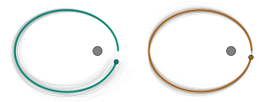

# Pick-and-Mix Information Operators for Probabilistic ODE Solvers - Code

This repo contains the code which was used to compute the results of the paper **"Pick-and-Mix Information Operators for Probabilistic ODE Solvers"**.


---

__To solve differential equations in Julia with probabilistic numerical solvers, please use
[ProbNumDiffEq.jl](https://github.com/nathanaelbosch/ProbNumDiffEq.jl)!__<br />
The code in this repository is not meant to be used as generic ODE solvers, whereas
[ProbNumDiffEq.jl](https://github.com/nathanaelbosch/ProbNumDiffEq.jl)
is a Julia package under active development.
It is more stable and documented, its solvers are more efficent, and it contains more features.
The DE solvers it provides are compatible with the
[DifferentialEquations.jl](https://docs.sciml.ai/stable/)
ecosystem.

---

A __Python__ implementation of these solvers, as well as of additional probabilistic numerical methods, is maintained in [ProbNum](https://github.com/probabilistic-numerics/probnum).


## Usage


### Figure 1
Run the script `experiments/0_kepler_samples/main.jl`
to obtain `./experiments/0_kepler_samples/figure1.pdf`:


### Case study 1: Second-order ODEs
The experiment script is `./experiments/1_secondorder_odes/1_compute_solutions.jl`.
Then, with `./experiments/1_secondorder_odes/2_plot_solutions.jl` you obtain the plot


### Case study 2: Additional second-derivative information
The experimentc can be run with
- `./experiments/2_additional_derivatives/2.1_lotkavolterra.jl`
- `./experiments/2_additional_derivatives/2.2_vanderpol.jl`

Then, to plot run `./experiments/2_additional_derivatives/3_plot_all.jl`


### Case study 3: Dynamical systems with conserved quantities
For figure 4, run (in order):
- `./experiments/3_conserved_quantities/1.1_generate_workprecision_data.jl`
- `./experiments/3_conserved_quantities/1.2_workprecision_plot.jl`


`./experiments/3_conserved_quantities/2_longtermplot.jl` to get figure 5:


And `./experiments/3_conserved_quantities/3_inflated_kepler_samples.jl` to get figure 6:



## Reference
```
TBD
```
